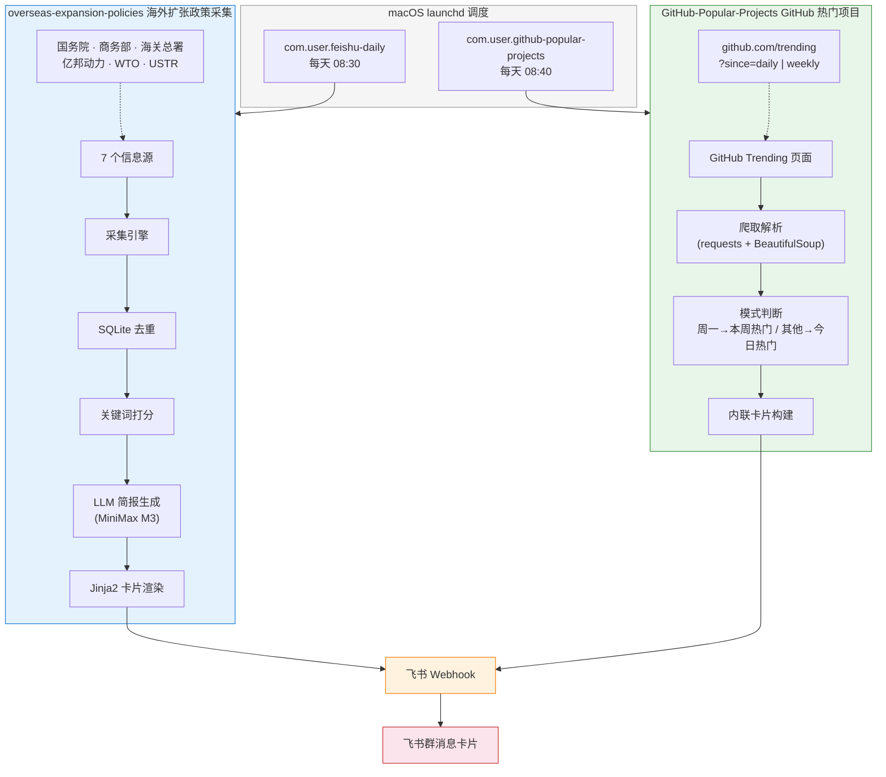

# Daily Tasks

自动化信息推送系统，每天定时采集数据并推送飞书卡片消息。

## 架构



## 项目结构

```
Daily-Tasks/
├── overseas-expansion-policies/   # 海外扩张政策采集
│   ├── collector.py               # 主脚本（采集→去重→打分→简报→推送）
│   ├── config.yaml                # 采集参数、飞书配置
│   ├── sources.yaml               # 7 个信息源定义
│   ├── keywords.yaml              # 打分关键词
│   ├── requirements.txt           # Python 依赖
│   ├── templates/
│   │   └── feishu_card.json       # 飞书卡片 Jinja2 模板
│   └── tests/
│       └── test_collector.py      # 41 个单元测试
│
├── GitHub-Popular-Projects/       # GitHub 热门项目推送
│   ├── collector.py               # 主脚本（爬取→判断模式→构建卡片→推送）
│   ├── requirements.txt           # Python 依赖
│   └── tests/
│       └── test_collector.py      # 9 个单元测试
│
└── .gitignore
```

## 两个子项目对比

| | overseas-expansion-policies | GitHub-Popular-Projects |
|---|---|---|
| **用途** | 海外扩张政策情报 | GitHub 热门项目 |
| **频率** | 每日 / 每周 / 每月 | 每日 / 每周 |
| **数据来源** | 国务院、商务部、海关总署、亿邦动力、WTO、USTR 等 7 个源 | GitHub Trending 页面 |
| **采集方式** | RSS、JSON API、Playwright 浏览器、静态页面 | requests + BeautifulSoup |
| **处理流程** | 去重 → 打分 → LLM 简报 → 卡片渲染 | 直接构建卡片 |
| **飞书卡片** | Jinja2 模板渲染 | Python 内联构建 |
| **依赖数** | 6 个 | 2 个 |
| **推送时间** | 08:30 | 08:40 |

## 运行模式

```
周一     → 每周精选（overseas）+ 本周热门（GitHub）
周二~周日 → 每日情报（overseas）+ 今日热门（GitHub）
每月1日  → 月度精选（overseas）+ 本周/今日热门（GitHub）
```

## 环境要求

- Python 3.14+
- macOS（使用 launchd 调度）

```bash
# 海外政策采集
pip3 install -r overseas-expansion-policies/requirements.txt
playwright install chromium

# GitHub 热门项目
pip3 install -r GitHub-Popular-Projects/requirements.txt
```

## 日志

所有运行时日志存放在各自项目的 `logs/` 目录下，launchd 的 stdout/stderr 也分别重定向到 `logs/stdout.log` 和 `logs/stderr.log`。
